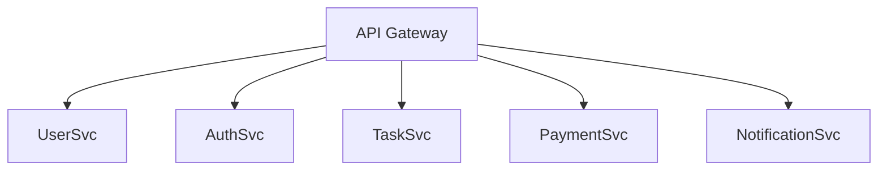

# Cloud-Native-Microservices-Platform
A scalable, cloud ready microservice architecture built to handle modular, distributed systems efficiently - from API Gateway to containerized services and CI/CD pipelines.

This project is my deep dive into modern backend engineering — building, deploying, and managing microservices the right way.

🚀 Tech Stack
| Layer                    | Technologies Used                              |
| ------------------------ | ---------------------------------------------- |
| **Backend Framework**    | Python (FastAPI)                               |
| **Database**             | PostgreSQL / MongoDB (per-service choice)      |
| **Containerization**     | Docker & Docker Compose                        |
| **Orchestration**        | Kubernetes (K8s)                               |
| **API Gateway**          | FastAPI Gateway / Traefik                      |
| **Communication**        | REST + gRPC (internal)                         |
| **Authentication**       | JWT, OAuth2                                    |
| **CI/CD**                | GitHub Actions / Jenkins                       |
| **Cloud Deployment**     | AWS (EKS, S3, CloudWatch) / Render for testing |
| **Monitoring & Logging** | Prometheus, Grafana, Loki                      |
| **Message Queue**        | RabbitMQ / Kafka (for async tasks)             |

## Architecture Overview

The project is structured around loosely coupled microservices — each one handling a specific domain and communicating via REST/gRPC.

Each service:
- Has its own database and Docker container
- Communicates securely via internal API network
- Scales independently on Kubernetes

## Core Features

- Authentication & Authorization Service (JWT + OAuth2)
- Central API Gateway with service routing
- Async Communication using RabbitMQ/Kafka
- Health checks, load balancing, fault tolerance
- CI/CD setup with auto-deploy to cloud cluster
- Service observability using Prometheus & Grafana
- Versioned APIs with automated docs via FastAPI Swagger

## why i build this project
- To understand real-world microservices deployment flow
- To build a scalable architecture that is ready for enterprise-level expansion

## Cloud deployment
- Each service is containerized and deployed via Kubernetes YAML manifests
- Uses GitHub Actions for CI/CD pipeline
- Logs and metrics are monitored using Prometheus + Grafana dashboard

## Learnings & Concepts work on
- Designing REST APIs in FastAPI for multiple services
- Implementing message queues and async processing
- Containerization, orchestration, and DevOps automation
- End-to-end deployment on AWS / Render
- System design principles for scalability & fault tolerance

## Future of project
- Add service mesh with Istio or Linkerd
- Add caching layer (Redis) for performance
- Integrate OpenTelemetry for full trace monitoring
- Role-based Access Control (RBAC) for admin panelctice container orchestration, monitoring, and DevOps integration
- Prepare for backend/cloud engineer interviews with hands-on knowledge
